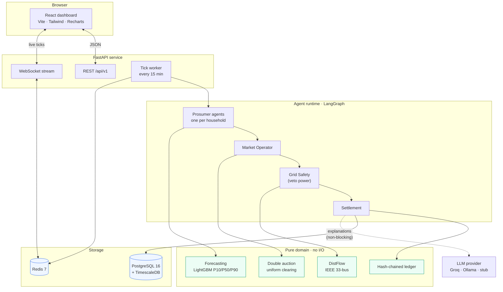
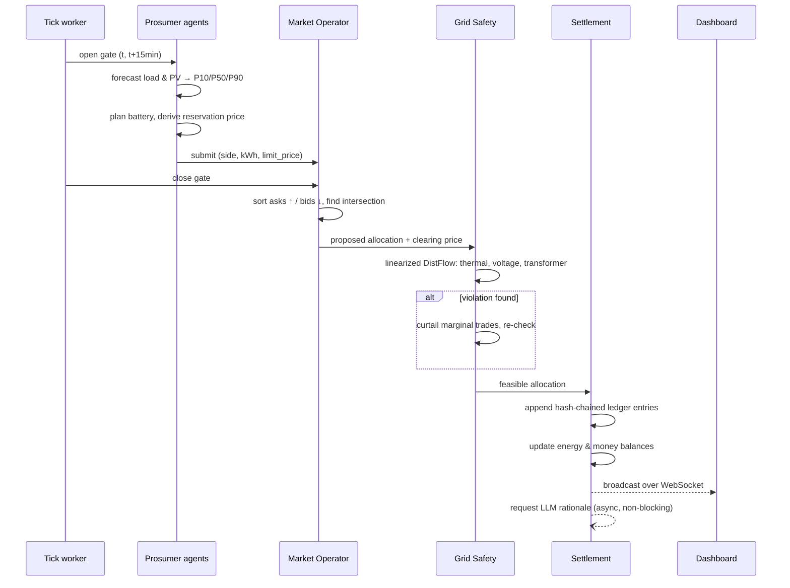

# Architecture

## System overview



The green layer is pure: deterministic functions with no database, network or clock access
([ADR-0006](adr/0006-pure-domain-layer.md)). The dotted LLM edge is deliberately the only one that may
fail without stopping a trade ([ADR-0005](adr/0005-llm-beside-the-critical-path.md)).

---

## The market tick

One tick is the unit of work. It runs every `MARKET_TICK_MINUTES` (default 15) of simulated time.



### Step detail

**1 · Forecast.** Each agent predicts its own next-interval consumption and generation as three
quantiles. A range, not a point — a household that *might* have surplus must bid differently from one
that certainly will.

**2 · Position.** Net position is `generation − consumption ± battery`. The battery policy chooses
charge/discharge against the forecast and the household's stated preferences. From this the agent derives
a **reservation price** — the worst price at which trading still beats the utility.

**3 · Order.** A seller's ask is floored at the feed-in tariff (never sell below what the utility pays);
a buyer's bid is capped at the retail tariff (never pay more than the utility charges). This is what makes
objective **O6** structurally true rather than hoped for.

**4 · Clearing.** Asks ascending, bids descending. Where the curves cross is the last mutually acceptable
match; the **uniform clearing price** sits at that intersection and every matched pair trades at it.
`AUCTION_MECHANISM` also offers `pay_as_bid` and `mid_market_rate` for comparison.

**5 · Grid safety.** The market found an allocation that is economically valid. Whether the wires can
carry it is a separate question. A linearized DistFlow solve over the IEEE 33-bus feeder checks line
thermal limits, transformer capacity and the statutory voltage band. Violations curtail the
least-valuable marginal trades and re-check. This layer has **veto power** and is the reason **O4** can be
stated as an absolute.

Safety is two-tier: the fast linearized solve runs inside the clearing loop (sub-millisecond, keeping
**O3** reachable), while a full pandapower AC Newton-Raphson solve runs periodically and during
evaluation to confirm the linearization never admitted a real violation.

**6 · Settlement.** Trades are appended to a ledger where each entry carries the hash of its predecessor.
Tampering with a historical trade invalidates every hash after it — tamper-evidence without the cost of
an actual blockchain. Balances update in the same ACID transaction.

**7 · Explain.** Rationale generation is fired asynchronously. If the LLM is slow or down, a
deterministic template is used and the tick is unaffected.

---

## Layering

Dependencies point inward only. Nothing in `domain/` imports from any layer above it.

```
api/ · workers/          ← HTTP, WebSocket, scheduling
      ↓
services/                ← orchestration, persistence, transactions
      ↓
domain/                  ← pure: market, grid, battery, ledger
```

| Package | Responsibility | May do I/O |
|---|---|---|
| `app/api/` | Route definitions, request/response mapping, auth | yes |
| `app/workers/` | Tick scheduling, background jobs | yes |
| `app/services/` | Orchestrates a tick, owns transactions, persists results | yes |
| `app/agents/` | LangGraph state machines, LLM provider interface | yes |
| `app/forecasting/` | Feature pipeline, model training and inference, backtests | yes |
| `app/simulator/` | Synthetic household and weather generation | yes |
| **`app/domain/`** | Auction, grid constraints, battery model, ledger | **no** |

---

## Data model sketch

| Table | Kind | Notes |
|---|---|---|
| `households` | relational | Identity, feeder bus, PV and battery specification |
| `meter_readings` | **hypertable** | Consumption and generation per interval |
| `forecasts` | **hypertable** | P10/P50/P90 per household per horizon |
| `orders` | **hypertable** | Every bid and ask submitted, with its reservation price |
| `market_ticks` | **hypertable** | Clearing price, matched volume, curtailment, latency |
| `trades` | relational | Matched pairs; immutable |
| `ledger_entries` | relational | Append-only, hash-chained, double-entry |
| `balances` | relational | Current energy and money position per household |
| `agent_decisions` | hypertable + `JSONB` | Decision inputs, outputs and rationale (**O7**) |

Hypertables give automatic time partitioning, compression of older chunks, and continuous aggregates that
make the dashboard's rollups cheap. See [ADR-0002](adr/0002-single-postgres-with-timescaledb.md).

---

## Failure behaviour

| Failure | Consequence |
|---|---|
| LLM unavailable | Explanations fall back to a deterministic template. **Trading unaffected.** |
| Redis unavailable | Live dashboard updates stop; ticks continue and settle. |
| Postgres unavailable | Ticks halt. Readiness returns 503 so the instance is drained. Nothing partially settles — the tick is one transaction. |
| Forecast model missing | Falls back to the seasonal-naive baseline. |
| Grid check infeasible | Trades curtailed until feasible; in the worst case the tick clears empty and households fall back to the utility. Never an unsafe allocation. |

## Further reading

- [Objectives](objectives.md) — how O1–O7 are measured
- [Runbook](runbook.md) — operating and troubleshooting
- [ADRs](adr/) — why the stack looks the way it does
